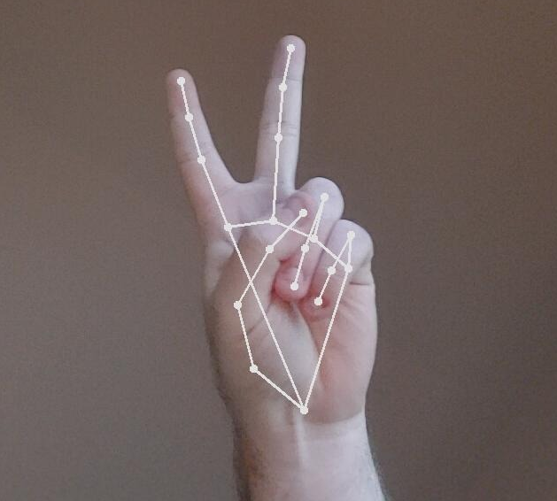
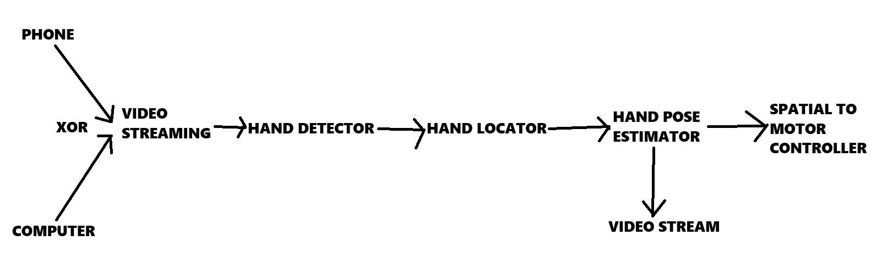

# Handful

Real-time image processing pipeline to detect hands and estimate their pose in 3D space.



## Intended Use

Real-time image processing to control servo motor actuation in 1DOF robotic fingers.

The image processing pipeline looks like this.



## Get Started 

### Clone the repository
```bash
git clone git@github.com:flynndoh/handful.git
cd handful
```

### Create and activate virtual environment
```bash
uv new
uv
```

### Install dependencies
```bash
uv pip install -e ".[dev]"
```

### Run!
```bash
handful --stream_url http://192.168.0.117:8080/stream
```
By default, navigate to http://localhost:5000

### Run the CLI (Work in progress, likely broken)
```bash
handful-cli mjpeg --url http://192.168.0.117:8080/stream serve
```

